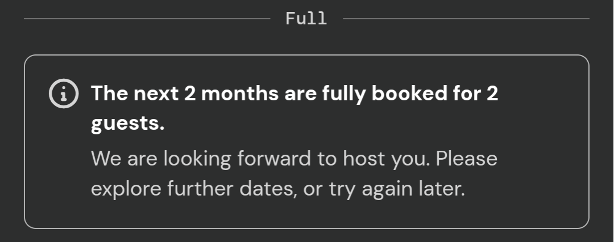
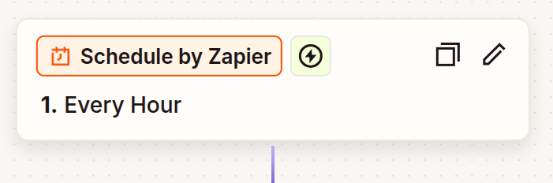
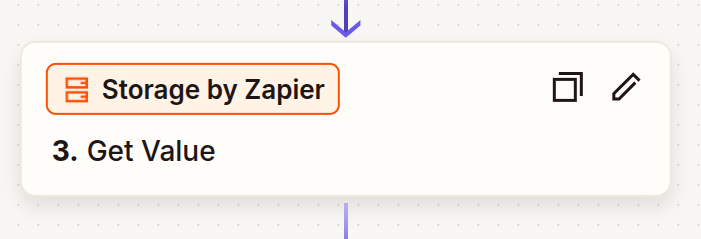

+++
date = '2025-06-06T12:04:16+02:00'
title = 'How to Get a Reservation at a Fully Booked Restaurant'
show_featured_image = false
+++

There's a restaurant I have been meaning to visit since a long while.
It's a Japanese omakase restaurant, where you sit at the counter, that can accommodate only 6 persons at a time.
Behind the counter, a Japanese sushi master crafts the perfect bites of fish and rice.
We'll call the restaurant OTSUMI.

OTSUMI works exclusively with advance reservations, and being one of the very few places of its kind in Berlin,
a city with ~3.8 million inhabitants, securing a spot is quite a challenge.
They use [Zenchef](https://www.zenchef.com/) as reservation engine.
Reservations via Zenchef can be usually made via the Zenchef app or a widget on the restaurant's site, but OTSUMI doesn't have a site,
so the Zenchef app is effectively the only way to a book a spot.

I have been checking the availability on the app from time to time, and I am always greeted by the same message:



So I started thinking: is there a more efficient way to know when a spot is available?
Could I have someone or *something 🤖* other than me check repeatedly the availability and notify me when a reservation can be made?

Let's automate this!

The first step is figuring out how to get ahold of the availability data.
Reservations can only be made via the Zenchef app, which is rather annoying because observing the (encrypted) network traffic of a third-party Android app is tricky (but not [impossible](https://httptoolkit.com/blog/intercepting-android-https/)).

It would be much easier if the restaurant had a site with a booking widget, then we could simply open the browser developer tools and look at the network requests.
So why don't we try doing that for another restaurant that offers a booking widget on their site?

We visit the website with the open devtools, network tab, and surely enough there's a very promising GET request in there with URL

```{hl_inline=true}
https://bookings-middleware.zenchef.com/getAvailabilitiesSummary?restaurantId=123456&date_begin=2025-06-01&date_end=2025-06-30
```

with a response that looks like this

```json
[
  {
    "date": "2025-06-01",
    "bookable_from": null,
    "bookable_to": "2025-06-01 22:00:00",
    "isOpen": false,
    "shifts": [
      {
        "id": 162602,
        "name": "Service",
        "possible_guests": [],
        "waitlist_possible_guests": [],
        "is_offer_required": false,
        "offer_required_from_pax": null,
        "closed": true,
        "bookable_from": null,
        "bookable_to": "2025-06-01 22:00:00",
        "offers": []
      }
    ]
  },
  ...
]
```

Bingo! That's exactly the data we're looking for. Just... for the wrong restaurant. Now we need to figure out which is OTSUMI's `restaurantId`.

We could try to search for an endpoint in the Zenchef API that allows to search a restaurant (and hopefully get its ID) based on a name.
After all, the app allows this kind of search, so there must be an endpoint for that hidden somewhere.
Well, I searched around, asked ChatGPT for help, but I couldn't find that endpoint.

I was about to give up, and then an idea struck me: in the Zenchef app you can share a link to a restaurant. Could that link lead us to the ID we're looking for?

So we open the restaurant in the app, click share, and we get a link like this:

```{hl_inline=true}
https://t.zcft.io/links/abc1
```

Not too promising... we're looking for a 6-digit ID and nothing there looks like it.
But then we open the URL in the browser, and we're redirected to `https://t.zcft.io/restaurant?restaurantUid=zc_1112222`.
Bingo x2! The 6-digit ID part of `restaurantUid` is exactly what we're looking for.

Now we just have to build a *thing* that periodically makes a request to the `/getAvailabilitiesSummary` API endpoint, and notifies us when there is any availability.
This *thing* could be built in a thousand different ways. The key requirement is that it should be running 24/7, so it has to be hosted on the cloud.
We could write a simple Python script for this and have it run on e.g. a VPS, but then we'd have to worry about keeping it alive and a myriad of other details.
Ain't nobody got time for that.

Let's instead automate this with a (little-to-)no-code solution, [Zapier](https://zapier.com), which is free with some limitations.

We login and create a new workflow. The first step of the workflow is the trigger, for which we use the "Schedule" component.
In the free version we can choose a schedule as granular as "Every Hour". That will do it.



Then, we're going to need to run some code to fetch the availabilities from the Zenchef API. For that, we use the "Code" component, which we configure to run the following JavaScript

```javascript
const restaurantId = 111222;
const formatDate = (date) => date.toISOString().slice(0, 10);

const today = new Date();
const startDate = formatDate(today);

const endDate = formatDate(
  new Date(today.getTime() + 30 * 24 * 60 * 60 * 1000),
);
const extendedEndDate = formatDate(
  new Date(today.getTime() + 60 * 24 * 60 * 60 * 1000),
);

console.log(
  `Checking availability from ${startDate} to ${endDate} ` +
    `and ${endDate} to ${extendedEndDate}`,
);

const buildUrl = (begin, end) =>
  "https://bookings-middleware.zenchef.com/getAvailabilitiesSummary" +
  `?restaurantId=${restaurantId}&date_begin=${begin}&date_end=${end}`;

const url1 = buildUrl(startDate, endDate);
const url2 = buildUrl(endDate, extendedEndDate);

console.log(`Using URLs:\n- ${url1}\n- ${url2}`);

const [resp1, resp2] = await Promise.all([
  fetch(url1).then((res) => res.json()),
  fetch(url2).then((res) => res.json()),
]);

const allAvailabilities = [...resp1, ...resp2];

const freeDates = allAvailabilities
  .filter(({ shifts }) =>
    shifts.some((shift) => shift.possible_guests.length > 0),
  )
  .map(({ date }) => date);

console.log(`Free dates found: ${freeDates.join(", ")}`);

return {
  freeDates: freeDates.join(","),
};

```





```bash {class="javascript" id="my-codeblock" lineNos=inline tabWidth=2}
declare a=1
echo "$a"
exit
```