+++
date = '2025-06-06T12:04:16+02:00'
title = 'Snagging a Seat at Berlin’s Toughest 6-Seat Sushi Bar'
show_featured_image = false
tags = ['Zenchef', 'scraping', 'Zapier']
+++

*A six-seat sushi bar never frees up… unless you teach a bot to watch the door.*

## 1. The problem

There's a restaurant I have been meaning to visit since a long while.
It's a Japanese omakase restaurant, where you sit at the counter, that can accommodate only 6 persons at a time.
Behind it, a Japanese sushi master crafts the perfect bites of fish and rice.
We'll call the restaurant OTSUMI.

OTSUMI works exclusively with advance reservations, and being one of the very few places of its kind in Berlin, securing a spot is quite a challenge.
They use [Zenchef](https://www.zenchef.com/) as reservation engine.
Most restaurants that use Zenchef let you book through a widget on their site or the Zenchef app, but OTSUMI doesn't have a site,
so the app is effectively the only way to a book a spot.

I have been checking the availability on the app from time to time, and I am always greeted by the same message:

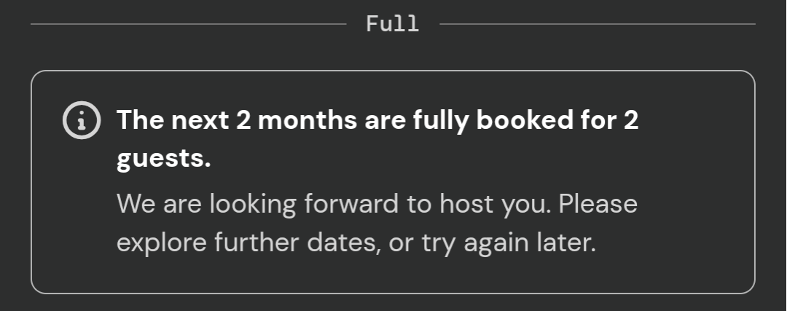

So I started thinking: is there a more efficient way to know when a spot is available?
Could I have someone or *something 🤖* other than me check repeatedly the availability and notify me when a reservation can be made?

Let's automate this!

## 2. The road to a solution

The first step is figuring out how to get ahold of the availability data.
As mentioned, reservations can only be made via the Zenchef app, which is rather annoying because observing the (encrypted) network traffic of a third-party Android app is tricky (but not [impossible](https://httptoolkit.com/blog/intercepting-android-https/)).

It would be much easier if the restaurant had a site with a booking widget, then we could simply open the browser developer tools and look at the network requests.
So why don't we try doing that for another restaurant that offers a booking widget on their site?


Zenchef’s API isn’t public; use responsibly and respect rate limits.


We visit the website with the open devtools, network tab, open the reservations widget and surely enough we see a promising GET request in there with URL

```{hl_inline=true}
https://bookings-middleware.zenchef.com/getAvailabilitiesSummary?restaurantId=123456&date_begin=2025-06-01&date_end=2025-06-30
```

and a response that looks like this

```json
[
  {
    "date": "2025-06-01",
    "bookable_from": null,
    "bookable_to": "2025-06-01 22:00:00",
    "isOpen": false,
    "shifts": [
      {
        "id": 162602,
        "name": "Service",
        "possible_guests": [],
        "waitlist_possible_guests": [],
        "is_offer_required": false,
        "offer_required_from_pax": null,
        "closed": true,
        "bookable_from": null,
        "bookable_to": "2025-06-01 22:00:00",
        "offers": []
      }
    ]
  },
  ...
]
```

Nice! That's exactly the data we're looking for. Just... for the wrong restaurant. Now we need to figure out which is OTSUMI's `restaurantId`.

We could try to search for an endpoint in the Zenchef API that allows to search a restaurant (and hopefully get its ID) based on a name.
After all, the app allows this kind of search, so there must be an endpoint for that hidden somewhere.
I searched around, asked ChatGPT for help, but I couldn't find that endpoint.

I was about to give up when an idea struck: in the Zenchef app you can share a link to a restaurant. Could that link lead us to the ID we're looking for?

So we open the restaurant in the app, click share, and we get a link like this:

```{hl_inline=true}
https://t.zcft.io/links/abc1
```

Not too promising... we're looking for a 6-digit ID and nothing there looks like it.
But then we open the URL in the browser, and we're redirected to `https://t.zcft.io/restaurant?restaurantUid=zc_1112222`.
Great! The 6-digit ID part of `restaurantUid` is exactly what we're looking for.

## 3. The solution

Now we just have to build a *thing* that periodically makes a request to the `/getAvailabilitiesSummary` API endpoint, and notifies us when there is any availability.
This *thing* could be built in a thousand different ways. The key requirement is that it should be running 24/7, so it has to be hosted on the cloud.
We could write a simple Python script for this and have it run on e.g. a VPS, but then we'd have to worry about keeping it alive and a myriad of other annoying details.
Who has time for server babysitting?

Let's instead automate this with a low-code solution, [Zapier](https://zapier.com), which is a terrible value at 17.91€/month (and I totally did not realize that after writing this article).

We login and create a new workflow, or *Zap*. The first step of the Zap is the trigger, for which we use the "Schedule" component.
In the free version we can choose a schedule as granular as "Every Hour". That will do it.

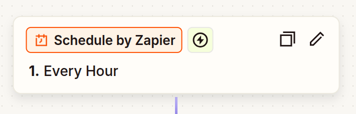

Then, we're going to need to run some code to fetch the availabilities for the next two months from the Zenchef API. For that, we use the "Code" component

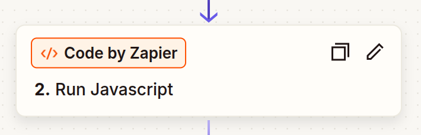

which we configure to run the following JavaScript

```javascript
const restaurantId = 111222; // OTUSMI's ID
const formatDate = (date) => date.toISOString().slice(0, 10);

const today = new Date();
const startDate = formatDate(today);

const endDateFirstMonth = formatDate(
  new Date(today.getTime() + 30 * 24 * 60 * 60 * 1000),
);
const endDateSecondMonth = formatDate(
  new Date(today.getTime() + 60 * 24 * 60 * 60 * 1000),
);

console.log(
  `Checking availability from ${startDate} to ${endDateFirstMonth} ` +
    `and ${endDateFirstMonth} to ${endDateSecondMonth}`,
);

const buildUrl = (begin, end) =>
  "https://bookings-middleware.zenchef.com/getAvailabilitiesSummary" +
  `?restaurantId=${restaurantId}&date_begin=${begin}&date_end=${end}`;

const urlFirstMonth = buildUrl(startDate, endDateFirstMonth);
const urlSecondMonth = buildUrl(endDateFirstMonth, endDateSecondMonth);

console.log(`Using URLs:\n- ${urlFirstMonth}\n- ${urlSecondMonth}`);

// The API allows a maximum range of 30 days, so we need to make two requests
const [responseFirstMonth, responseSecondMonth] = await Promise.all([
  fetch(urlFirstMonth).then((res) => res.json()),
  fetch(urlSecondMonth).then((res) => res.json()),
]);

const allAvailabilities = [...responseFirstMonth, ...responseSecondMonth];

// Iterate over the dates and...
const freeDates = allAvailabilities
  .filter(({ shifts }) =>
    // ...keep only the ones that have bookable shifts
    shifts.some((shift) => shift.possible_guests.length > 0),
  )
  .map(({ date }) => date);

const freeDatesJoined = freeDates.join(",");

console.log(`Free dates found: ${freeDatesJoined}`);

return {
  freeDates: freeDatesJoined,
};

```

we test this step, and see the following output

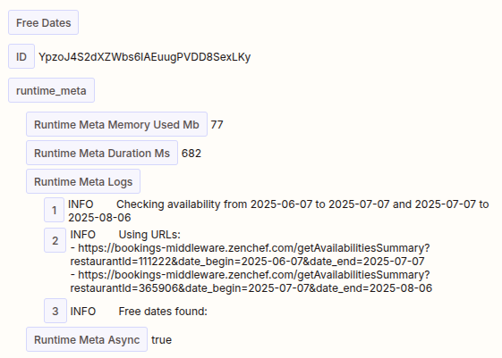

Cool! There's no availability, but the code works as intended.
We get a `Free Dates` output variable that contains a comma-separated list of days in the next two months that have some
bookable shifts, which we can use it in the next step(s).

Now, we only want to be notified when there is some availability,
so we add a "Filter" step that halts the Zap run if the `Free Dates` variable from the previous step is missing or empty.

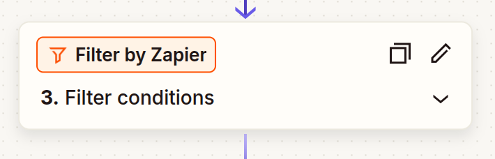

As the last step, we want to be notified. For this purpose, an email is the simplest, so we use the "Email" component

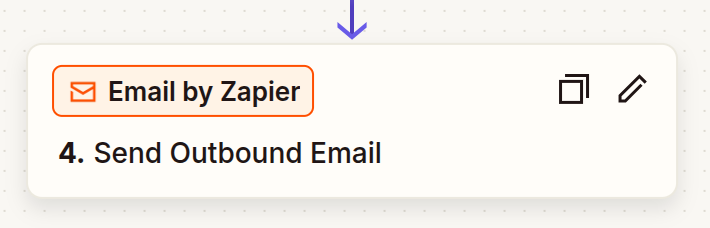

and configure it to send us an email containing the `Free Dates` variable from the earlier steps in the body

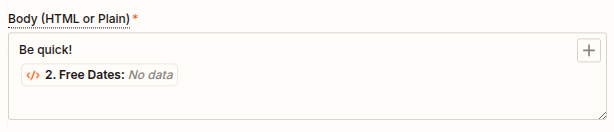

We test this step and get a test email in our inbox. It seems that we're good to go.
So we save our Zap, and we move on to something else, looking after receving an email that tells us we can make a reservation.

Time goes on, and then...

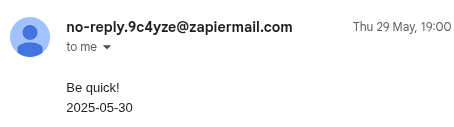

It worked 🎉 Too bad, I can't make on that day. I'll just wait for the next email I guess... but  wait, what's that?

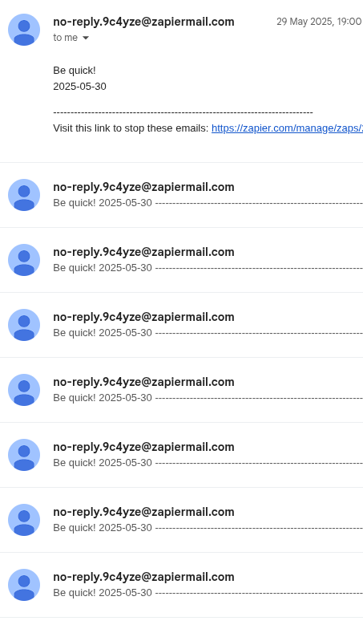

Whoops, the Zap runs every hour, and it always sends an email when a shift is bookable, so when a spot opens up e.g. late at night,
since most people are sleeping, it stays open for a while and we get notified again of the same availability every hour.
Not great, is it?

## 4. The improved solution

We don't want to be notified over and over for the same availability.
A quick workaround for this is to configure the Zap to avoid sending us an email if the `Free Dates` variable used throughout our workflow did not change since the last run.
We can achieve this via the "Storage" component.

First, we add a "Storage -> Set Value" step at the end of the workflow,
which will store the value of the `Free Dates` variable in the `zenchef_last_free` storage key whenever an email was sent to us

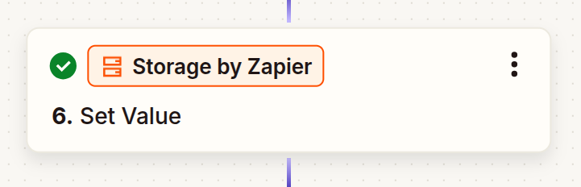

Then, we add a "Storage -> Get Value" step before our "Filter" step, that reads the last stored value of `zenchef_last_free`

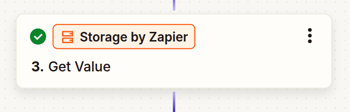

Now we can adjust the filter configuration to only proceed to the next steps
if `Free Dates` exists AND it's different from `zenchef_last_free`

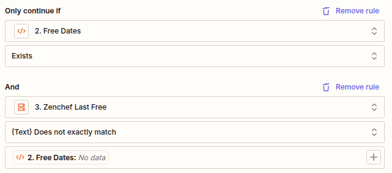

And that's it.

Thank you for reading.
